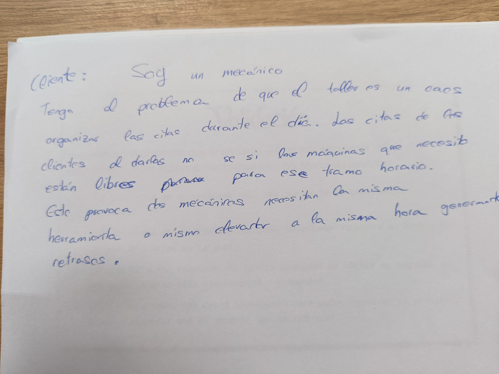
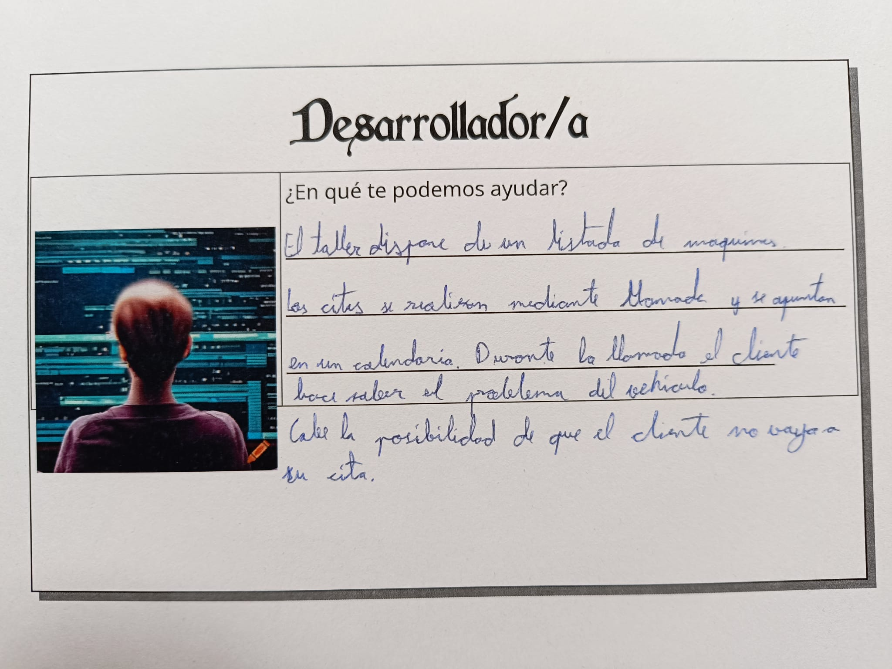
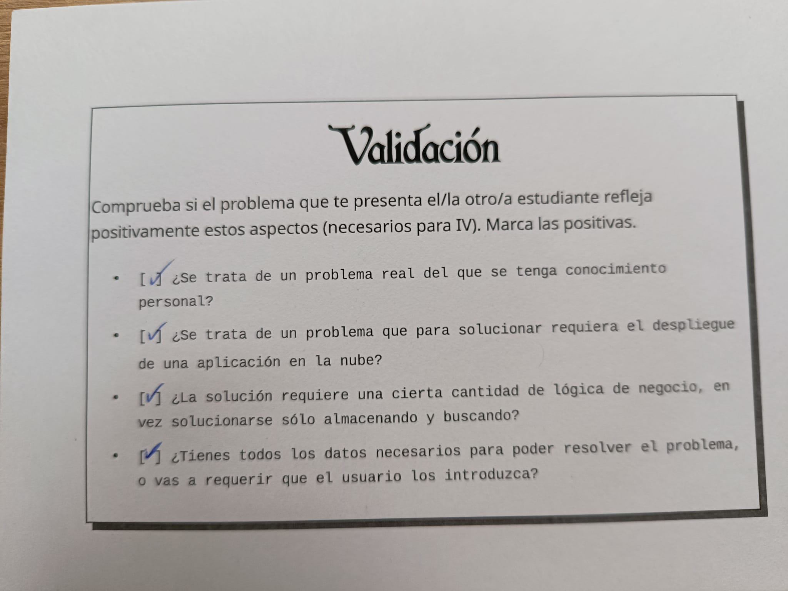
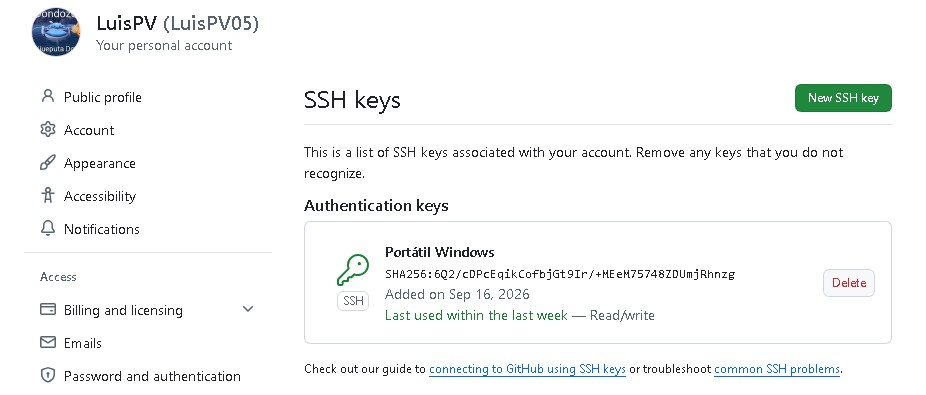
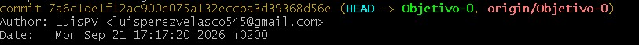

# Objetivo 0: configuracion

## Tarjetas del juego de rol
En las imagenes se muestran las tarjetas correspondientes a los diferentes roles que se hizieron durante la primera clase del curso.

## Clave SSH
En la imagen se muestra la clave SSH publica que he configurado en mi cuenta de GitHub. Esta configuracion me permite conectarme y trabajar con mis repositorios de GitHub de forma segura mediante SSH.

## Nombre y correo de git
En la imagen se muestra la configuracion de Git con mi nombre y direccion de correo electronico. Estos datos quedan asociados a los commits que realizo, permitiendo identificar que los cambios del repositorio han sido realizados por mi.
